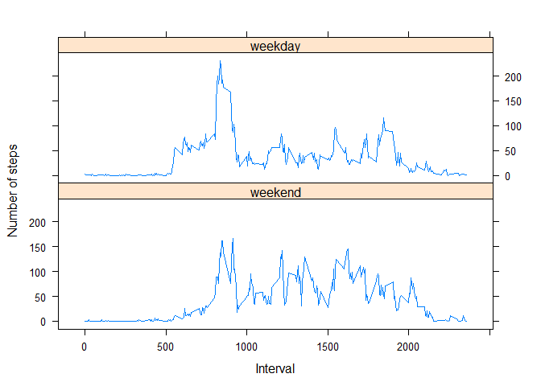

# Reproducible Research: Peer Assessment 1


## Loading and preprocessing the data

```r
dt <- read.csv("activity.csv", colClasses = "character")
dt$date<-as.Date(dt$date)
dt$steps<-as.numeric(dt$steps)
dt$interval<-as.numeric(dt$interval)
```


## What is mean total number of steps taken per day?


```r
library(dplyr)
```

```
## 
## Attaching package: 'dplyr'
## 
## The following object is masked from 'package:stats':
## 
##     filter
## 
## The following objects are masked from 'package:base':
## 
##     intersect, setdiff, setequal, union
```

```r
temp<-group_by(dt,date)
total<-summarise(temp, total=sum(steps,na.rm=TRUE))
hist(total$total,col="blue", main="Histogram of the total number of steps taken each day",xlab="Total number of steps taken each day")
```

 

```r
mean(total$total,na.rm=TRUE)
```

```
## [1] 9354.23
```

```r
median(total$total,na.rm=TRUE)
```

```
## [1] 10395
```


## What is the average daily activity pattern?


```r
temp1<-group_by(dt,interval)
mean<-summarise(temp1, mean=mean(steps,na.rm=TRUE))
qqplot(mean$interval,mean$mean, type="l",xlab="interval",ylab="mean")
```

 

```r
mean[which.max(mean$mean),1]
```

```
## Source: local data frame [1 x 1]
## 
##   interval
## 1      835
```


## Imputing missing values

```r
sum(is.na(dt$steps))
```

```
## [1] 2304
```
The strategy to impute the missing data is to put mean for that 5-minute interval, calculated over all days. 

```r
dt1<-dt
for (i in 1:length(dt1$steps)){
        if (is.na(dt1$steps[i])){
                x<-dt1$interval[i]
                y<-subset(mean, interval== x)
                dt1$steps[i]<-y[1,2]
        }
}
```


```r
dt1$steps<-as.numeric(dt1$steps)
temp2<-group_by(dt1,date)
total1<-summarise(temp2, total=sum(steps))
hist(total1$total,col="blue", main="Histogram imputing missing data",xlab="Total number of steps taken each day")
```

 

```r
mean(total1$total,na.rm=TRUE)
```

```
## [1] 10766.19
```

```r
median(total1$total,na.rm=TRUE)
```

```
## [1] 10766.19
```
Both the mean and the median increased. When NAs were removed it produced zeros in the calculations, which resulted negative bias.

## Are there differences in activity patterns between weekdays and weekends?


```r
library(lattice)
weekdays <- c('Monday', 'Tuesday', 'Wednesday', 'Thursday', 'Friday')
dt1$wday <- factor((weekdays(dt1$date) %in% weekdays),levels=c(FALSE, TRUE), labels=c('weekend', 'weekday')) 
temp3<-group_by(dt1,wday,interval)
mean1<-summarise(temp3, mean=mean(steps))

p<-xyplot(mean ~ interval|wday, data=mean1, layout = c(1, 2),type="l",xlab="Interval", ylab="Number of steps")
print(p)
```

 
